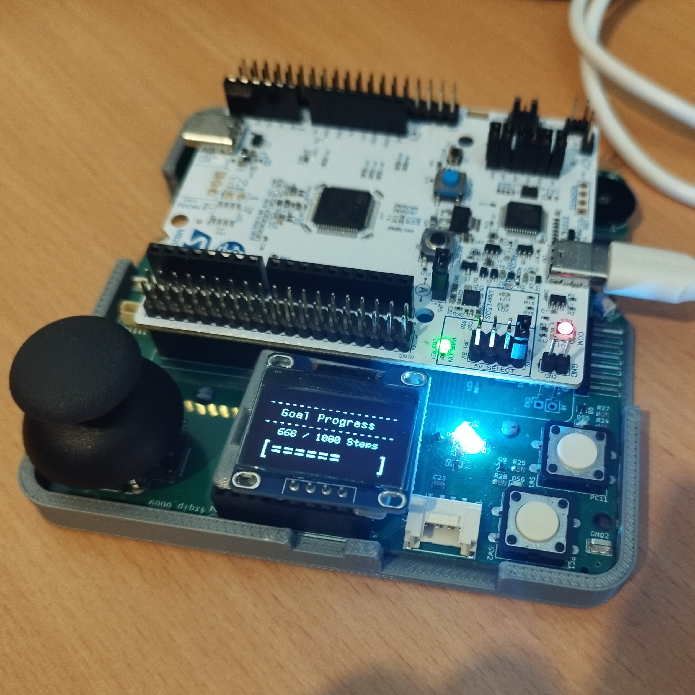

  

# Embedded Systems Step Counter
### STM32C071 | C | Interrupt-Driven Firmware | ENCE361 — University of Canterbury

A pedometer embedded system built on the **STM32C071 Nucleo** development board for the ENCE361 
course at the University of Canterbury. Developed in a team of two.

---

## Overview
Firmware that tracks a user's steps via the onboard IMU, estimates distance travelled, 
and provides a full graphical user interface — all running on an interrupt-driven kernel.

---

## Features

### Step Detection
- Responds to **hardware interrupts** from the IMU when a step is detected — no polling
- Estimates distance travelled assuming a fixed step length of 0.8m
- Full reset on board reset button, returning steps, distance, and goal to defaults

### User Interface
- **Three display states** — Current Steps, Distance Travelled, Goal Progress — cycled 
  via joystick left/right
- **Unit toggling** — steps as raw count or % of goal; distance in km or yards
- **Set Goal mode** — entered via joystick long-press; goal set using rotary potentiometer 
  (500–15,000 steps)
- **LED progress indicators** — four LEDs reflect goal completion in 25% increments, 
  with the first LED gradually brightening for partial progress
- **Buzzer alert** on goal completion

### Test Mode
- Activated via double-tap of SW2
- Joystick up/down increments/decrements step count at a rate proportional to displacement
- Bounded between zero and ten steps below the current goal
- Useful for debugging and validation without physically walking

### Firmware Design
- **Interrupt-driven kernel** with a task scheduler for predictable, robust behaviour
- Shared resource handling and concurrency considerations throughout
- Clean modular structure: IMU driver, GUI FSM, and scheduler as key subsystems

---

## Tech Stack
**Language:** C  
**MCU:** STM32C071 Nucleo  
**IDE:** STM32CubeIDE + STM32CubeMX  
**Peripherals:** IMU (I2C), LCD, LEDs, Joystick, Rotary Potentiometer, Piezoelectric Buzzer  
**Version Control:** Git (GitLab → GitHub)
